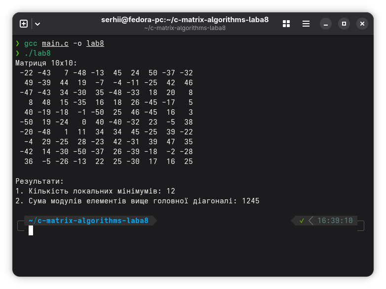

# Lab Work 8: 2D Array (Matrix) Algorithms in C

This project is a laboratory work for the "Computer Technologies and Programming" course. It contains a C program demonstrating the use of **nested loops** and **two-dimensional arrays (matrices)** for performing calculations and data analysis.

## Programs Included

### 1. Matrix Local Minimums and Diagonal Sum (`main.c`)

This program performs two independent calculations on a 10x10 matrix populated with random integers from -50 to 50:
- **Task 1: Local Minimums.** It counts the number of "local minimums" in the matrix. An element is a local minimum if it is strictly smaller than all of its adjacent neighbors (horizontally, vertically, and diagonally).
- **Task 2: Sum Above Main Diagonal.** It calculates the sum of the absolute values (modules) of all elements located strictly above the main diagonal of the matrix.

## How to Compile and Run

The program can be compiled using GCC or an equivalent C compiler.

### Compile `main.c`
```bash
gcc main.c -o main
./main
```

## Example Usage

Example run of **`main.c`**:
```text
Матриця 10x10:
  30  -2  45 ...
 -10  23 -50 ...
...

Результати:
1. Кількість локальних мінімумів: 4
2. Сума модулів елементів вище головної діагоналі: 1245
```



## Contributing

Contributions are welcome and appreciated! Here's how you can contribute:

1. Fork the project
2. Create your feature branch (`git checkout -b feature/AmazingFeature`)
3. Commit your changes (`git commit -m 'Add some AmazingFeature'`)
4. Push to the branch (`git push origin feature/AmazingFeature`)
5. Open a Pull Request

Please make sure to update tests as appropriate and adhere to the existing coding style.

## License

This project is licensed under the CSSM Unlimited License v2.0 (CSSM-ULv2). See the [LICENSE](LICENSE) file for details.
